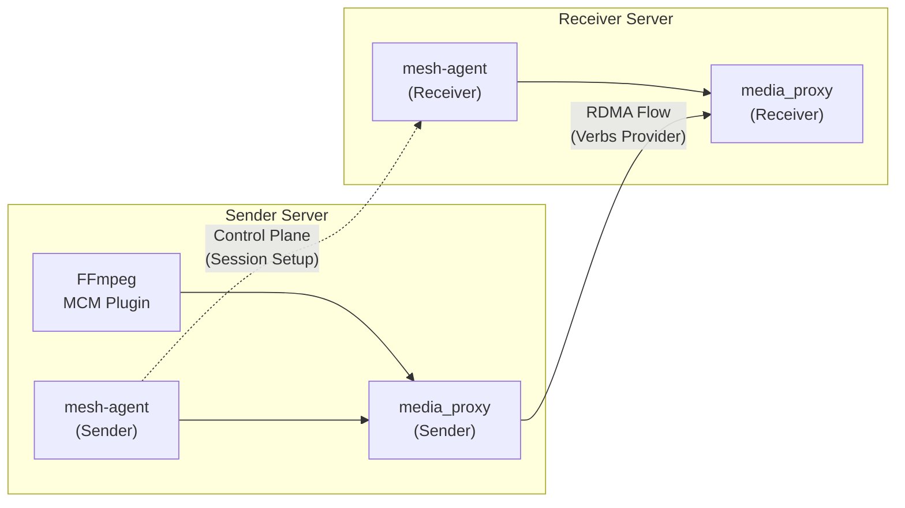
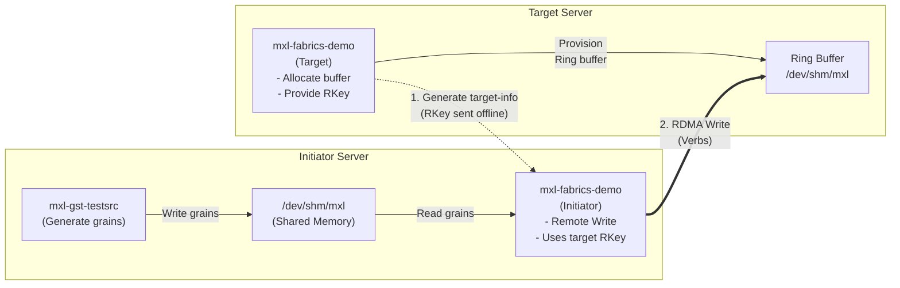
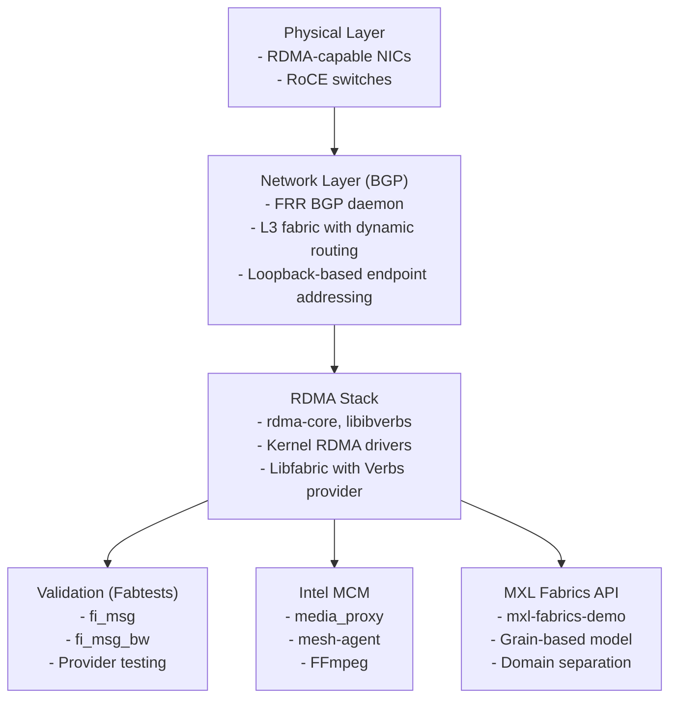

<!--
SPDX-FileCopyrightText: 2026 CBC/Radio-Canada
SPDX-License-Identifier: CC-BY-4.0
-->

# RDMA Lab Documentation

This documentation guides you through building and testing **RDMA (Remote Direct Memory Access)** capabilities in a professional media production environment. The lab implementation focuses on four main objectives:

1. **Understanding Libfabric and RDMA fundamentals** through Intel's Media Communications Mesh (MCM)
2. **Implementing MXL (Media eXchange Layer)** with RDMA support as defined in [dmf-mxl/mxl PR#266](https://github.com/dmf-mxl/mxl/pull/266)
3. **Deploying an L3 BGP-based RDMA network** following Arista's [AI Network Fabric Deployment Guide](https://www.arista.com/assets/data/pdf/AI-Network-Fabric_Deployment_Guide.pdf)
4. **Load testing and characterizing RDMA network behavior** through multi-stream MXL testing with PFC/ECN profiling

## Documentation Structure

The documentation is organized to guide you through a progressive learning and implementation journey:

```sh
README.md                       # This file - Overview and navigation
docs/
├── setup.md                    # Foundation: RDMA prerequisites and libfabric
├── bgp-config.md               # Network: L3 BGP configuration for RDMA fabric
├── libfabric-fabtests.md       # Validation: Testing RDMA connectivity
├── intel-mcm.md                # Application 1: Intel MCM implementation
└── mxl-fabrics-rdma.md         # Application 2: MXL with RDMA (Fabrics API)

scripts/
├── network_saturation_test.py  # Automated multi-flow MXL load testing
├── network_monitor.py          # Network bandwidth monitoring (WIP)
├── cleanup.py                  # Test environment cleanup utility
├── config.json                 # Test configuration (IPs, paths, parameters)
└── data/                       # Flow templates and test data
```

## Learning Path

### Phase 1: Foundation Setup

Start with the foundational components that all RDMA applications depend on:

#### 1.1 [Server RDMA Setup](./docs/setup.md)

**Purpose:** Install and configure the RDMA stack on Ubuntu servers.

**Key topics:**

- Installing RDMA core libraries (`rdma-core`, `ibverbs-providers`, `libibverbs-dev`)
- Building and installing **Libfabric** with RDMA Verbs provider support
- Verifying RDMA hardware and driver functionality

**Prerequisites:**

- Linux server (Ubuntu 22.04 or 24.04)
- RDMA-capable NIC (InfiniBand or RoCE)
- Updated NIC drivers and firmware

**Key validation:**

```bash
fi_info -p verbs  # Confirm Verbs provider is available
ibv_devinfo       # Verify RDMA device detection
```

#### 1.2 [BGP Network Configuration](./docs/bgp-config.md)

**Purpose:** Configure Layer 3 BGP routing between servers and switches to enable RDMA fabric connectivity.

**Key topics:**

- Installing and configuring **FRR (Free Range Routing)**
- Establishing BGP peering sessions between servers and RDMA switches
- Advertising loopback interfaces for consistent RDMA addressing
- Validating route propagation across the fabric

**Network architecture:**

- L3 BGP fabric design (following Arista AI Network Fabric guidelines)
- Dynamic route advertisement using BGP
- Loopback-based RDMA endpoint addressing

**Key validation:**

```bash
sudo vtysh -c "show ip bgp summary"  # Verify BGP session state
sudo vtysh -c "show ip route"        # Confirm route learning
```

**Why BGP for RDMA?**

The L3 BGP approach provides:

- **Scalability:** Easy addition of new servers without manual route configuration
- **Resilience:** Automatic failover and path selection
- **Flexibility:** Support for multiple RDMA subnets and VLANs
- **Industry alignment:** Follows proven AI/ML fabric architectures

### Phase 2: RDMA Validation

#### 2.1 [Libfabric Fabtests](./docs/libfabric-fabtests.md)

**Purpose:** Validate RDMA connectivity and performance using standard Libfabric test utilities.

**Key topics:**

- Running functional tests (`fi_msg`, `fi_rdm_pingpong`)
- Measuring RDMA bandwidth and latency
- Comparing TCP vs. RDMA Verbs provider performance
- Troubleshooting RDMA connection issues

**Test categories:**

- **Functional tests:** Verify basic message passing and RMA operations
- **Benchmark tests:** Measure bandwidth (`fi_msg_bw`) and latency (`fi_msg_pingpong`)
- **Provider comparison:** TCP (baseline) vs. Verbs (RDMA)

**Key validation:**

```bash
# Functional message test with RDMA
./fi_msg -p verbs -s <server_ip>  # Server side
./fi_msg <server_ip> -p verbs     # Client side
```

### Phase 3: Application Implementations

With RDMA infrastructure validated, proceed to application-level implementations:

#### 3.1 [Intel Media Communications Mesh (MCM)](./docs/intel-mcm.md)

**Purpose:** Implement Intel's MCM to understand how professional media applications leverage Libfabric and RDMA.

**Key topics:**

- Building MCM components (`mesh-agent`, `media_proxy`, FFmpeg plugin)
- Configuring RDMA-based media stream routing
- Using FFmpeg to encode and transmit video over RDMA
- Understanding control plane (mesh-agent) vs. data plane (media_proxy) separation

**Architecture:**



**Key concepts:**

- Media proxy as RDMA endpoint
- FFmpeg integration with MCM URN addressing
- RDMA provider selection (`-rdma_provider verbs`)

**Key validation:**

```bash
# Confirm media proxy RDMA connectivity
sudo media_proxy -d <vf_interface> --rdma_ip=<ip> --agent <agent_ip>:50051
```

#### 3.2 [MXL with RDMA (Fabrics API)](./docs/mxl-fabrics-rdma.md)

**Purpose:** Implement the MXL (Media eXchange Layer) RDMA capability as defined in [PR#266](https://github.com/dmf-mxl/mxl/pull/266), enabling inter-host data transfer using Libfabric.

**Key topics:**

- Building MXL with Libfabric/OFI support (`-DMXL_FABRICS_OFI=ON`)
- Understanding MXL's domain separation and grain-based media model
- Implementing inter-host RDMA using MXL's fabric transport
- Comparing shared memory (intra-host) vs. RDMA (inter-host) grain transfer

**MXL data model:**

- **Grains:** Atomic units of media data (video frames, audio samples)
- **Flows:** Continuous sequences of grains
- **Domains:** Isolated execution contexts for security and resource management

**Transfer modes:**

1. **Shared Memory (Intra-host):** Zero-copy ring buffer between processes on same server
2. **Libfabric/RDMA (Inter-host):** RDMA transfer into a target-managed ring buffer using a copy-based memory model

**Architecture:**



**Key validation:**

```bash
# Target: Generate target-info token
./mxl-fabrics-demo -d /dev/shm/mxl -f v210_flow.json -n <ip> -p verbs

# Initiator: Connect and transfer grains via RDMA
./mxl-fabrics-demo -d /dev/shm/mxl -f <flow_uuid> -i -n <ip> -p verbs --target-info <token>
```

**Why MXL matters:**

- **Professional media standard:** Open initiative by EBU for interoperable media exchange
- **Container-friendly:** Enables distributed, containerized media workflows
- **Low latency:** Direct memory access eliminates traditional network stack overhead
- **Scalable:** Designed for cloud-native and on-premises deployments

### Phase 4: Network Load Testing and Characterization

With MXL RDMA functionality validated, the next phase focuses on understanding network behavior under load and optimizing for production deployment.

#### 4.1 Multi-Stream MXL Load Testing

**Purpose:** Generate multiple concurrent MXL RDMA flows to characterize network saturation behavior and validate fabric performance.

**Key topics:**

- Automating multi-flow MXL test scenarios using Python orchestration
- Generating deterministic flow configurations with Jinja2 templates
- Monitoring network utilization and bandwidth consumption
- Identifying bottlenecks and performance limits in the RDMA fabric

**Test automation tools:**

The `scripts/` directory contains Python utilities for automated load testing:

- **`network_saturation_test.py`**: Orchestrates multi-flow MXL tests
  - Generates N concurrent MXL flows with configurable resolutions and frame rates
  - Sets up target and initiator servers via SSH
  - Launches `mxl-gst-testsrc` and `mxl-fabrics-demo` processes in parallel
  - Monitors process status and collects logs

- **`network_monitor.py`**: Real-time bandwidth monitoring
  - Tracks network interface utilization during tests
  - Records bandwidth metrics at configurable intervals
  - Exports data for analysis and visualization

- **`cleanup.py`**: Test environment cleanup
  - Terminates all MXL processes on remote servers
  - Removes temporary files and shared memory
  - Resets environment for next test iteration

**Configuration:**

All tests are controlled via `config.json`, which specifies:

- Management IPs (SSH/control plane)
- RDMA interface IPs (data plane traffic)
- Server credentials and paths
- Test parameters (flow count, resolutions, frame rates)

**Example test workflow:**

```bash
# Generate 50 concurrent MXL flows for network saturation
cd scripts/
./network_saturation_test.py --config config.json --num-flows 50

# Monitor network utilization in separate terminal
./network_monitor.py --interface <rdma_interface> --duration 15

# Cleanup after test
./cleanup.py --config config.json
```

**Key features:**

- **Deterministic UUIDs**: Flow files use consistent identifiers for reproducible testing
- **Human-readable naming**: Files like `flow_1_1920x1080_30000_1001.json` for easy identification
- **Parallel execution**: All flows launch simultaneously for true saturation testing
- **Automated setup**: Creates directories, transfers files, and configures both servers

#### 4.2 PFC and ECN Profiling

**Purpose:** Enable and profile Priority Flow Control (PFC) and Explicit Congestion Notification (ECN) mechanisms as recommended in the Arista AI Network Fabric Deployment Guide.

**Key topics:**

- Configuring PFC on RDMA switches and NICs
- Enabling ECN for congestion management
- Measuring network behavior under congestion scenarios
- Tuning QoS parameters for optimal RDMA performance

**PFC/ECN concepts:**

- **Priority Flow Control (PFC)**: IEEE 802.1Qbb standard that prevents frame loss due to congestion by pausing specific priority classes
- **Explicit Congestion Notification (ECN)**: RFC 3168 mechanism that marks packets during congestion instead of dropping them
- **RoCEv2 requirements**: Both PFC and ECN are critical for lossless RDMA operation over Ethernet

**Test scenarios:**

1. **Baseline (no PFC/ECN)**: Measure packet loss and performance degradation under saturation
2. **PFC enabled**: Validate zero packet loss with flow control
3. **ECN enabled**: Monitor congestion marking and response
4. **Combined PFC+ECN**: Optimal configuration for production RDMA fabric

**Metrics collection**

The key performance metrics we collect during these tests include packet loss rates at various load levels, PFC pause frame frequency and duration, ECN marking percentages, throughput and latency measurements under congestion scenarios, and buffer utilization statistics on the switches. Currently, we are relying on metrics provided by Arista CloudVision as a Service (CVaaS) for network visibility and monitoring. However, as we continue to experiment with different load patterns and congestion scenarios, we are actively exploring additional metric collection methods to supplement our current monitoring capabilities and provide more granular insights into RDMA network behavior.

**Future work: MXL-RDMA and ST 2110 Coexistence**

A critical question for production deployment is whether MXL RDMA traffic can coexist with ST 2110 media streams on the same network fabric. This investigation will explore:

- QoS class separation between RDMA and ST 2110 traffic
- VLAN isolation strategies
- Impact of RDMA traffic on ST 2110 timing precision (PTP)
- Bandwidth allocation and priority schemes
- Jitter analysis when both traffic types are present

**Reference documentation:**

- Arista AI Network Fabric Deployment Guide sections on PFC/ECN configuration
- See `scripts/README.md` for detailed test execution instructions

## How the Components Connect

### Dependency Flow



### Common Concepts Across Implementations

| Concept | Intel MCM | MXL Fabrics API | Purpose |
|---------|-----------|-------------|---------|
| **Libfabric Provider** | `verbs` | `verbs` | RDMA transport abstraction |
| **Control Plane** | `mesh-agent` | Target-info exchange | Session establishment |
| **Data Plane** | `media_proxy` | `mxl-fabrics-demo` | Actual media/data transfer |
| **Addressing** | IP + URN | IP + Flow UUID | Endpoint identification |
| **Memory Model** | Direct RDMA write | Ring buffer + RDMA write | Data delivery mechanism |
| **Media Format** | FFmpeg-encoded streams | Raw grains (V210, audio) | Payload structure |

## Quick Start Guide

### For New Users

If you're starting from scratch:

1. **Start with [setup.md](./docs/setup.md)**
   - Install RDMA prerequisites
   - Build Libfabric with Verbs provider
   - Verify hardware detection

2. **Configure network with [bgp-config.md](./docs/bgp-config.md)**
   - Install FRR
   - Configure BGP peering
   - Verify route exchange

3. **Validate RDMA with [libfabric-fabtests.md](./docs/libfabric-fabtests.md)**
   - Run `fi_msg` functional tests
   - Measure baseline TCP performance
   - Confirm Verbs provider performance gains

4. **Choose your application path:**
   - **Intel MCM path:** Follow [intel-mcm.md](./docs/intel-mcm.md) for FFmpeg-based video streaming
   - **MXL path:** Follow [mxl-fabrics-rdma.md](./docs/mxl-fabrics-rdma.md) for grain-based media exchange


### For Experienced Users

If you already have RDMA infrastructure:

- **Jump to [intel-mcm.md](./docs/intel-mcm.md)** if you want to explore professional media streaming over RDMA
- **Jump to [mxl-fabrics-rdma.md](./docs/mxl-fabrics-rdma.md)** if you're interested in the MXL standard and Fabircs API implementation

## Troubleshooting Resources

### Common Issues

| Symptom | Likely Cause | Resolution |
|---------|--------------|------------|
| `fi_info` shows no providers | Libfabric not built with Verbs | Rebuild with `--enable-verbs` |
| BGP session stuck in "Active" | Switch/server misconfiguration | Verify neighbor IP and ASN |
| `ibv_devinfo` returns empty | RDMA drivers not loaded | Install `rdma-core` and reboot |
| Fabtests timeout | Firewall blocking traffic | Check `iptables` or disable firewall |
| MCM media_proxy fails | Missing RDMA IP configuration | Verify `--rdma_ip` parameter |
| MXL target-info error | Shared memory not created | Create `/dev/shm/mxl` directory |

### Debug Commands

```bash
# Check RDMA hardware
ibv_devinfo
ibv_devices

# Verify Libfabric providers
fi_info
fi_info -p verbs

# Test BGP status
sudo vtysh -c "show ip bgp summary"
sudo vtysh -c "show ip bgp neighbors"

# Monitor RDMA traffic (if applicable)
sudo tcpdump -i <rdma_interface> -n

# Check shared memory
df -h /dev/shm
ls -la /dev/shm/mxl
```

## Additional Resources

### External Documentation

- **Libfabric:** https://ofiwg.github.io/libfabric/
- **RDMA Core:** https://github.com/linux-rdma/rdma-core
- **FRR Routing:** https://docs.frrouting.org/
- **Intel MCM:** https://github.com/OpenVisualCloud/Media-Communications-Mesh
- **MXL Standard:** https://tech.ebu.ch/dmf/mxl
- **MXL PR#266:** https://github.com/dmf-mxl/mxl/pull/266
- **Arista AI Fabric Guide:** https://www.arista.com/assets/data/pdf/AI-Network-Fabric_Deployment_Guide.pdf

### Internal Resources

- **Team Confluence:** [RDMA Network Documentation](https://cbcradiocanada.atlassian.net/wiki/spaces/ENG/pages/5597298950/RDMA+Network)
- **Architecture Diagram:** [Lucidchart](https://lucid.app/lucidchart/3f4623a6-dd6f-41af-a6c3-64ba7efa9dc8/edit)
- **Contacts:**
  - RDMA/Libfabric: Alexandre Dugas, Sunday Nyamweno
  - BGP/Networking: Reimar Papruz

## Contributing

When adding new documentation:

1. Follow the existing structure (Prerequisites → Setup → Validation → Troubleshooting)
2. Include command examples with expected output
3. Add cross-references to related documents
4. Update this README with navigation links
5. Include architecture diagrams where applicable

---

**Last Updated:** January 28, 2026  
**Maintained By:** RDMA Lab Team
