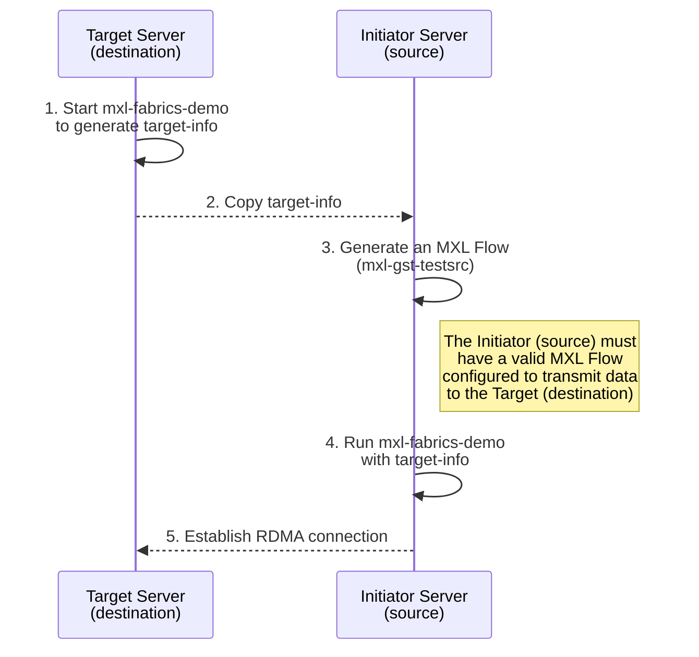

<!--
SPDX-FileCopyrightText: 2026 CBC/Radio-Canada
SPDX-License-Identifier: CC-BY-4.0
-->

# MXL-Fabrics-API RDMA Build and Testing Guide

This document provides a complete walkthrough for building and testing the **MXL-Fabrics-API** environment on a Ubuntu 24.04 system.  
It covers installation prerequisites, build instructions, environment setup, test execution, and important notes for maintaining consistency between test servers.

---
## What is MXL and Why Use It?

**MXL (Media eXchange Layer)** is the foundational layer of the **Dynamic Media Facility (DMF)** reference architecture. It's an open-source initiative designed to enable seamless, interoperable media exchange between professional audio-visual production software.

**Key characteristics of MXL:**

- **Media Exchange Focus:** Specifically designed for efficient media data transfer between professional AV applications
- **Rapid Development:** Prioritizes software innovation and fast iteration cycles  
- **Collaborative Approach:** Joint effort between professional users and solution implementers
- **Global Initiative:** Open standard not restricted to any single company or geographic region

**The Challenge MXL Addresses:**

Traditional media workflows rely on rigid, hardware-dependent systems with dedicated network streams for media transport. This creates bottlenecks, increases costs, and limits flexibility in modern production environments.

Instead of using fixed hardware and dedicated network streams, MXL enables **containerized and distributed media functions** that can exchange media “grains” through **shared memory** or **high-speed fabrics** such as **RDMA (Remote Direct Memory Access)**.

- **Grains:** Units of media data (audio, video, or ancillary).  
- **Flows:** Continuous sequences of grains forming a media stream.

MXL provides:

- **APIs** for creating and managing media flows (e.g., reading/writing grains).  
- A **data model** describing the structure and handling of grains.  

By allowing processes to share or transfer grains directly through shared memory or RDMA, MXL significantly reduces latency and CPU overhead, avoiding the traditional packet-based transmission model.

MXL supports two main modes for sharing grains:

1. **Shared Memory (Zero-Copy Ring Buffer)**  
   - Two processes on the **same host** share a common memory region.  
   - Both processes share a common memory region, allowing one to write and the other to read grains without copying — resulting in near-zero latency.  

2. **Libfabric Transport (Inter-Host Copying)**  
   - Used when grains need to be transferred between **different machines**.  
   - MXL leverages libfabric to efficiently copy grains between hosts using RDMA, EFA, or TCP.  
   - If RDMA is available, data transfer occurs directly between memory spaces on both hosts, minimizing CPU intervention.
---
## Table of Contents

1. [Before You Begin](#1-before-you-begin)  
2. [Prerequisite Libraries and Environment Checks](#2-prerequisite-libraries-and-environment-checks)  
3. [Cloning the MXL Repository](#3-cloning-the-mxl-repository)  
4. [Building MXL (Ubuntu 24.04)](#4-building-mxl-ubuntu-2404)  
   - [4.1 Build Configuration](#41-build-configuration)  
   - [4.2 Run the Build](#42-run-the-build)  
   - [4.3 Verify and Package Built Resources](#43-verify-and-package-built-resources)  
     - [4.3.1 Check Build Artifacts](#431-check-build-artifacts)  
     - [4.3.2 Confirm Executable Permissions](#432-confirm-executable-permissions)  
     - [4.3.3 Create the Portable Build Directory](#433-create-the-portable-build-directory)  
     - [4.3.4 Copy All Build Artifacts](#434-copy-all-build-artifacts)  
     - [4.3.5 Create the Compressed Archive](#435-create-the-compressed-archive)  
     - [4.3.6 Transfer the Package to Target Servers](#436-transfer-the-package-to-target-servers)  
     - [4.3.7 Extract the Package on the Target Server](#437-extract-the-package-on-the-target-server)  
     - [4.3.8 Verify the Extraction](#438-verify-the-extraction)  
5. [Preparing the Test Environment](#5-preparing-the-test-environment)  
6. [Running the RDMA Tests](#6-running-the-rdma-tests)   
7. [References](#7-references)  
---

## 1. Before You Begin

This guide explains how to build and test the **MXL Fabrics API RDMA** environment directly on physical servers.
It assumes an intermediate understanding of RDMA and Libfabric concepts.

### Required Equipment

- Two RDMA-capable servers running **Ubuntu 24.04**.
   -  **Ubuntu 22.04** no longer supported ([Spring Cleaning](https://github.com/dmf-mxl/mxl/commit/b21e6e960b5940098d7ced3ced3e78ce72a1d30a))
- Each server must have an **InfiniBand** or **RoCE**-enabled NIC.
- Adequate disk space and available shared memory (`/dev/shm`).
- Stable network connection between both systems.

### Preliminary Steps

1. **Complete the MXL Hands-On Exercises:**  
   Before proceeding, complete the exercises in the official repo:  
   [MXL Hands-On Repository](https://github.com/cbcrc/mxl-hands-on/tree/main/Exercises)  
   These exercises provide foundational experience with Docker-based builds and RDMA functionality.

2. **Repository Location:**  
    Both servers must clone the repository into the **same home directory path**: `~/mxl-hands-on`

3. **Environment Consistency Tips:**

    - Use the same Ubuntu version on both servers.
    - Verify that both NICs have compatible RDMA driver and firmware versions.
    - Ensure Docker and Libfabric versions match on both machines.

---

## 2. Prerequisite Libraries and Environment Checks

Before building MXL, confirm that all dependencies are installed and the RDMA environment is functional.

### 2.1 Verify Installed Libraries and Interfaces

```bash
fi_info --version
whereis librdmacm.so
ip a
```

### 2.2 Install Required Packages (if missing)

```bash
sudo apt update
sudo apt install -y ninja-build docker.io git build-essential cmake
```

### 2.3 Verify Docker Installation

```bash
docker --version
docker run hello-world
```
---
## 3. Cloning the MXL Repository

The `mxl-hands-on` repository is our public-facing enterprise gateway for MXL development and testing. It is designed to simplify the onboarding process by providing a curated environment that wraps the core MXL logic with practical utility.

**What’s inside this repository:**

- The Core MXL Submodule: This repo includes the official dmf-mxl repository as a git submodule, ensuring you are working with the industry-standard codebase.

- Ready-to-Use Build Scripts: Automated scripts tailored for multiple Operating Systems to streamline the compilation process.

- Docker Exercises: Pre-configured environments and exercises to help you build and run MXL inside containers, isolating dependencies and ensuring portability.

- Educational Resources: Documentation and tools specifically organized to help developers understand the nuances of the Media eXchange Layer.

> Before you begin the build process, ensure you have reviewed the prerequisites in the previous sections.

### 3.1. Clone the CBC fork of the MXL project

Download the main entry-point repository to your host.
```bash
git clone https://github.com/cbcrc/mxl-hands-on
cd ~/mxl-hands-on
```

### 3.2. Initialize the submodules
Since the core MXL code is managed as a submodule, you must initialize it to pull the actual source code into the dmf-mxl directory.
```bash
git submodule update --init
```

### 3.3. Confirm the repository structure
Verify that the cloning process was successful and that all necessary directories, including the submodule and tools, are present.
```bash
ls
# Expected directories:
# dmf-mxl/  tools/  scripts/
```

### 3.4. `add` and `checkout` main [dmf-mxl/mxl](https://github.com/dmf-mxl/mxl)
The Fabrics API is now part of the main MXL codebase (merged via PR266). Add the parent repository as a new remote and check out the main branch containing the latest Fabrics implementation. No external fork or feature branch is required.

```bash
cd dmf-mxl
git remote -v # There should be 1 remote: origin
git remote add rdma https://github.com/dmf-mxl/mxl.git
git remote -v # There should be 2 remotes: origin and rdma
git fetch rdma
git checkout main
```
---
## 4. Building MXL (Ubuntu 24.04)

The MXL build process generates the necessary RDMA demo and source applications.
Build artifacts can be generated on one host and transferred between host for an efficient build process.

### 4.1 Build Configuration

Ensure that your build_linux.sh file contains the following settings:

> **Note:** Docker must be run with increased shared memory (`--shm-size=2gb`) to ensure validation tests pass.
>
> To enable the Fabrics build, add `-DMXL_ENABLE_FABRICS_OFI=ON` to your CMake configuration.

```bash
MXL_PROJECT_PATH="dmf-mxl"   
   
# Build Docker image
docker build \
   --build-arg BASE_IMAGE_VERSION=24.04 \
   --build-arg USER_UID=${USER_UID} \
   --build-arg USER_GID=${USER_GID} \
   \
   -t mxl_build_container_${COMP_LOWER} \
   -f ${MXL_PROJECT_PATH}/.devcontainer/Dockerfile \
   ${MXL_PROJECT_PATH}/.devcontainer

# ensure the changes in devcontainer reflects the BASE_IMAGE_VERSION, choose accordingly 

ARCHITECTURES=("x86_64")
COMPILERS=("Linux-Clang-Release") # or "Linux-GCC-Release"

# Configure CMake
docker run --shm-size=2gb
# in CMake build options add -DMXL_ENABLE_FABRICS_OFI=ON

# Build Project
docker run --shm-size=2gb

# Run Tests
docker run --shm-size=2gb
```

---

### 4.2 Run the Build

From the repository root (`~/mxl-hands-on`):

```bash
./build_linux.sh
```

---

### 4.3 Verify and Package Built Resources

After the build completes successfully, verify the presence of the generated executables and configuration files before packaging the artifacts into a portable archive. The archive can then be distributed and deployed across multiple test environments.


#### 4.3.1 Check Build Artifacts

```bash
ls ~/mxl-hands-on/dmf-mxl/build/Linux-<compiler>-Release
```

Expected files include:

**Shared Libraries:**

* `libmxl-*.so*` (Various MXL shared libraries)
* `libmxl-fabrics.so` (Fabrics library with Libfabric transport implementation)
* `libmxl-common.so*` (Common MXL runtime libraries)

**Executable Tools:**

* `mxl-info` (Information utility for MXL)
* `mxl-gst-sink` (GStreamer sink plugin)
* `mxl-gst-testsrc` (GStreamer test source plugin)
* `mxl-fabrics-demo` (RDMA demo executable for inter-host communication)

**Configuration Files:**

* Flow configuration files (`.json`) such as `v210_flow.json`, which define media streams and RDMA data paths


#### 4.3.2 Confirm Executable Permissions

```bash
chmod +x <binary file>
```

This makes a file executable, meaning the system is allowed to run it as a program.


#### 4.3.3 Create the portable build directory

```bash
cd ~/mxl-hands-on
mkdir ../portable-mxl-<version_id>
```

This creates a directory to hold all packaged build artifacts.


#### 4.3.4 Copy all build artifacts

Copy all necessary libraries, tools, and configuration files into the portable directory:

```bash
# Copy shared library files required for runtime execution
cp ./dmf-mxl/build/Linux-<compiler>-Release/lib/*.so* ../portable-mxl-<version_id>/
cp ./mxl-hands-on/dmf-mxl/build/Linux-<compiler>-Release/lib/internal/*.so* ./portable-mxl-<version_id>/

# Copy utility tools
cp ./dmf-mxl/build/Linux-<compiler>-Release/tools/mxl-info/mxl-info ../portable-mxl-<version_id>/
cp ./dmf-mxl/build/Linux-<compiler>-Release/tools/mxl-gst/mxl-gst-sink ../portable-mxl-<version_id>/
cp ./dmf-mxl/build/Linux-<compiler>-Release/tools/mxl-gst/mxl-gst-testsrc ../portable-mxl-<version_id>/

# Copy flow configuration files that define media streams and RDMA data paths
cp ./dmf-mxl/build/Linux-<compiler>-Release/lib/tests/data/*.json ../portable-mxl-<version_id>/

# Copy the main RDMA demo executable used for testing inter-host communication
cp ./dmf-mxl/build/Linux-<compiler>-Release/tools/mxl-fabrics-demo/mxl-fabrics-demo ../portable-mxl-<version_id>/

# Copy the Fabrics library containing the Libfabric transport implementation for RDMA operations
cp ./dmf-mxl/build/Linux-<compiler>-Release/lib/fabrics/ofi/libmxl-fabrics.so ../portable-mxl-<version_id>/
```

**Files being copied:**

* Shared libraries (`.so*`): Runtime dependencies
* `mxl-info`: Information utility for MXL
* `mxl-gst-sink`: GStreamer sink plugin
* `mxl-gst-testsrc`: GStreamer test source plugin
* Flow configuration (`.json`): Media stream and RDMA data path definitions
* `mxl-fabrics-demo`: RDMA demo executable
* `libmxl-fabrics.so`: Fabrics library with Libfabric transport implementation


#### 4.3.5 Create the compressed archive

```bash
tar czf ../portable-mxl-<version_id>.tar.gz --directory=../portable-mxl-<version_id>/ .
```

This packages all resources into a compressed tar archive (`portable-mxl-<version_id>.tar.gz`). The archive can now be transferred to other test servers.

> **Note:** After creating the archive, verify its contents:

```bash
tar tzf ../portable-mxl-<version_id>.tar.gz | head -20
```

Upon completion, confirm that the archive is created without errors and all necessary binaries and configuration files are included.


#### 4.3.6 Transfer the package to target servers

Transfer the compressed archive and any additional libraries to the target test servers using `scp` (SSH copy):

```bash
# Transfer the main archive to the target server
scp portable-mxl-<version_id>.tar.gz lab@<target_server_ip>:/home/lab/portable-mxl-<version_id>.tar.gz

# Transfer any additional shared libraries if needed
scp libmxl-common.so.1.1 lab@<target_server_ip>:/home/lab/portable-mxl-<version_id>/
```

**Parameters:**

* `<target_server_ip>`: The IP address of the destination test server
* `lab`: The SSH username on the target server
* `/home/lab/`: The destination directory path on the target server

> **Note:** Ensure SSH access is configured between the build server and target servers before attempting the transfer. Both servers should have consistent directory structures for reproducibility.


#### 4.3.7 Extract the package on the target server

After the transfer completes, extract the archive on the target server to prepare the portable build for testing.

**On the target server:**

```bash
# Navigate to the directory where the archive was transferred
cd /home/lab/

# Create the extraction directory if it doesn't exist
mkdir -p portable-mxl-<version_id>

# Extract the archive contents
tar -xzf portable-mxl-<version_id>.tar.gz -C portable-mxl-<version_id>/
```


#### 4.3.8 Verify the extraction

```bash
# List the extracted contents to confirm all files are present
ls -la portable-mxl-<version_id>/
```

Expected files should include:

* `libmxl-*.so*` (shared libraries)
* `mxl-fabrics-demo` (RDMA demo executable)
* `mxl-info`, `mxl-gst-sink`, `mxl-gst-testsrc` (utility tools)
* `*.json` configuration files

After successful extraction, the portable build is ready for test environment setup on the target server.


---
## 5. Preparing the Test Environment

### 5.1. Create the shared memory directory on both servers
Establish the necessary directory within the temporary file storage system to facilitate zero-copy grain exchange between processes.
```bash
sudo mkdir /dev/shm/mxl

df -h /dev/shm # Confirm sufficient shared memory space
```

### 5.2. Identify and note each server’s IP address
Determine the network identity of each node to ensure the initiator can correctly route RDMA traffic to the target server.
```bash
ip a

# The target server will use its own IP address in all test commands.
# The initiator server will reference the target’s IP.
```

### 5.3. Identify Flow configuration file
Locate the JSON-based flow definition which specifies the media parameters and the RDMA data path required for the transfer.

- The .json flow file defines the RDMA data path and configuration between initiator and target.
- The example v210_flow.json is provided in the build output directory.

---

## 6. Running the RDMA Tests

This section explains how to execute RDMA functional tests using the **verbs** provider.  
Optionally, you can use **TCP** as a control to verify the build and environment.

**Domain separation** is a core MXL feature that enables security, scalability, and workload isolation, as detailed in [Exercise 2 of cbcrc/mxl-hands-on](https://github.com/cbcrc/mxl-hands-on/blob/main/Exercises/Exercise2.md).  
Due to domain separation, memory sharing between domains is always performed by copy, while sharing within a domain uses direct memory access.


With this in mind, the MXL Fabrics API implements inter-host RDMA transfers using a copy-based memory model to preserve domain isolation.

Additional background on the inter-host memory model is available here:
[Inter-host memory sharing – MXL design notes](https://github.com/dmf-mxl/mxl/wiki/MXL-Inter-host-memory-sharing-%E2%80%90-Proposition#memory-models)




**Legend:**

- **Target Server:** Runs `mxl-fabrics-demo`, generates `target-info`.
- **Initiator Server:** Starts `mxl-gst-testsrc`, runs `mxl-fabrics-demo` with `target-info`.
- **Arrows between servers** show transfer of `target-info` and RDMA connection establishment.

**Executable Files:**
- `mxl-fabrics-demo`: RDMA demo application for inter-host communication and testing
- `mxl-gst-testsrc`: GStreamer test source plugin that generates video grains for transmission
- `mxl-gst-sink`: GStreamer sink plugin for receiving media streams
- `mxl-info`: Information utility for inspecting MXL configurations

### Steps to Test RDMA in MXL

1. **Start the `mxl-fabrics-demo` on the target host**  
   This will generate a `target-info` token required by the initiator.

2. **Copy the `target-info` to the initiator host**  
   This token is needed to establish the RDMA connection.

3. **Generate an MXL flow on the initiator host**  
   This source will define the flow to be shared.

4. **Start the `mxl-fabrics-demo` on the initiator**  
   Use the appropriate flow file and the `target-info` token to connect to the target.

5. **Start the `mxl-gst-sink` to visualize MXL grains on target**
   Refer to the correct flow file found in the targets `/dev/shm/mxl/` directory  

Follow these steps to validate RDMA functionality and domain separation in your MXL environment.

#### 6.1 Target Server

Run the following command to start the demo target:

```bash
./mxl-fabrics-demo -d /dev/shm/mxl -f v210_flow.json -n <server_ip> --service 5000 -p verbs
```

> The target invokes `fi_fabric()` and `fi_domain()` to create a libfabric fabric using the specified provider (e.g., verbs for RDMA).
> - It **allocates a ring buffer** — a region of shared memory — where incoming grains will be written.
> - A Target Flow object is created, containing the necessary connection information for the initiator (including the fabric address and memory registration key, or RKey)

#### 6.2 Initiator Server

**Start an MXL source**

```bash
./mxl-gst-testsrc -d /dev/shm/mxl/domain -f v210_flow.json
```

> This generates video grains (in V210 format) that will be transferred

Open a new session (tab) on the Initiator Server and run:

**Send MXL flow to target**

```bash
./mxl-fabrics-demo -d /dev/shm/mxl -f <flow_uuid> -i -n <server_ip> --service 5000 -p verbs --target-info <copied_from_target>
```

>- Once the target info is obtained, the initiator parses it to extract the target’s fabric address and RKey
>- Using this information, it performs a Remote Write — a type of RDMA operation that allows direct modification of the target’s memory without involving the remote CPU.
>- The initiator’s NIC uses Direct Memory Access (DMA) to write the media grains straight into the target’s ring buffer — achieving low-latency, high-throughput data transfer

**Example Successful Output**

**Target Server:**

<div style="border:1px solid #333; padding:10px; border-radius:4px; background:#f7f7f7;">

<pre>
[2026-05-12 20:56:19.175] [info] [Endpoint.cpp:100] Endpoint 6675095969484600930 created
[2026-05-12 20:56:19.175] [info] [RCTarget.cpp:129] Received connected event notification, now connected.
</pre>

</div>


>- On the target side, the "Committed Grain" message shows each incoming frame being fully received into the ring buffer
>- Each index corresponds to one slot in the target's shared ring buffer.

**Initiator Server:**  
<div style="border:1px solid #333; padding:10px; border-radius:4px; background:#f7f7f7;">

<pre>
[2026-05-05 13:26:38.065] [info] [demo.cpp:634] Running as initiator
[2026-05-05 13:26:38.068] [warning] [Libfabric:fabric:efa:242] efa_device_construct_gid failed for device_idx 0, err=-95
[2026-05-05 13:26:38.068] [warning] [Libfabric:fabric:efa:242] efa_device_construct_gid failed for device_idx 1, err=-95
[2026-05-05 13:26:38.068] [warning] [Libfabric:fabric:efa:242] efa_device_construct_gid failed for device_idx 2, err=-95
[2026-05-05 13:26:38.068] [warning] [Libfabric:fabric:efa:242] efa_device_construct_gid failed for device_idx 3, err=-95
[2026-05-05 13:26:38.068] [warning] [Libfabric:fabric:efa:242] efa_device_construct_gid failed for device_idx 4, err=-95
[2026-05-05 13:26:38.068] [warning] [Libfabric:fabric:efa:242] efa_device_construct_gid failed for device_idx 5, err=-95
[2026-05-05 13:26:38.178] [info] [Endpoint.cpp:100] Endpoint 12445152030507297366 created
[2026-05-05 13:26:38.178] [info] [RCInitiator.cpp:112] Endpoint has been idle for 62122542ms, activating
[2026-05-05 13:26:38.528] [info] [RCInitiator.cpp:146] Endpoint is now connected
[2026-05-05 13:26:38.628] [console] [info] [demo.cpp:201] Using batch size of 1080 slices

</pre>

</div>

> Debug log can be displayed by running:`export MXL_LOG_LEVEL=debug`

#### 6.3 Visualizing MXL Flows

Once the RDMA transfer is active, you need a way to verify that the media grains are arriving correctly and maintaining integrity. You can monitor the flows using either a visual playback tool or a detailed telemetry utility.

**1. Visual Verification (GStreamer Sink)**
Use this method if you want to see the actual video frames being reconstructed in real-time. This provides immediate visual confirmation that the data path is clean and the grains are being assembled correctly.

```bash
./mxl-gst-sink -d /dev/shm/mxl -v <flow_id>
```

* **Note:** This should be executed on the **target server** where the grains are being received.
* **`mxl-gst-sink`**: A specialized GStreamer sink plugin that hooks into the MXL shared memory to render incoming media streams.
* **Outcome**: Launches a video viewer window allowing you to visually inspect the frames for artifacts or dropped data.

**2. Metadata Inspection (`mxl-info`)**
For a quick view into the performance of the flow without video rendering, use the `mxl-info` utility. This is ideal for debugging latency or timing issues.

```bash
./mxl-info -d /dev/shm/mxl -v <flow_id>
```

* **`mxl-info`**: A lightweight information utility designed for inspecting live MXL configurations and flow states.
* **Metrics Provided**: Displays real-time data on ingested grains, including precise latency measurements, effective frame rates, and grain sequence numbers.

**Example Successful Output**

**Target Server:**

<div style="border:1px solid #333; padding:10px; border-radius:4px; background:#f7f7f7;">

<pre>
- Flow [flow_id]
        Version: 1
    Struct size: 2048
         Format: Video
Grain/sample rate: 30000/1001
  Commit batch size: 1080
    Sync batch size: 1080
   Payload Location: Host
       Device Index: -1
              Flags: 00000000
        Grain count: 5

         Head index: 53286343275
    Last write time: 1777987729192163534
     Last read time: 1777987611209204397
   Latency (grains): 256
             Active: true
</pre>

</div>


## 7. References

- [EBU DMF/MXL Official page](https://tech.ebu.ch/dmf/mxl)
- [CBC/Radio-Canada MXL Development Repository](https://github.com/cbcrc/mxl-hands-on)
- [MXL Fabrics API implementation discussion](https://github.com/dmf-mxl/mxl/pull/266)
- [MXL Exercises](https://github.com/cbcrc/mxl-hands-on/tree/main/Exercises)
- [Team Confluence Page](https://cbcradiocanada.atlassian.net/wiki/spaces/ENG/pages/5597298950/RDMA+Network) – Detailed explanations of test behavior and provider-level analysis
- Reach out to Sunday Nyamweno and Anthony Royer for more detail

