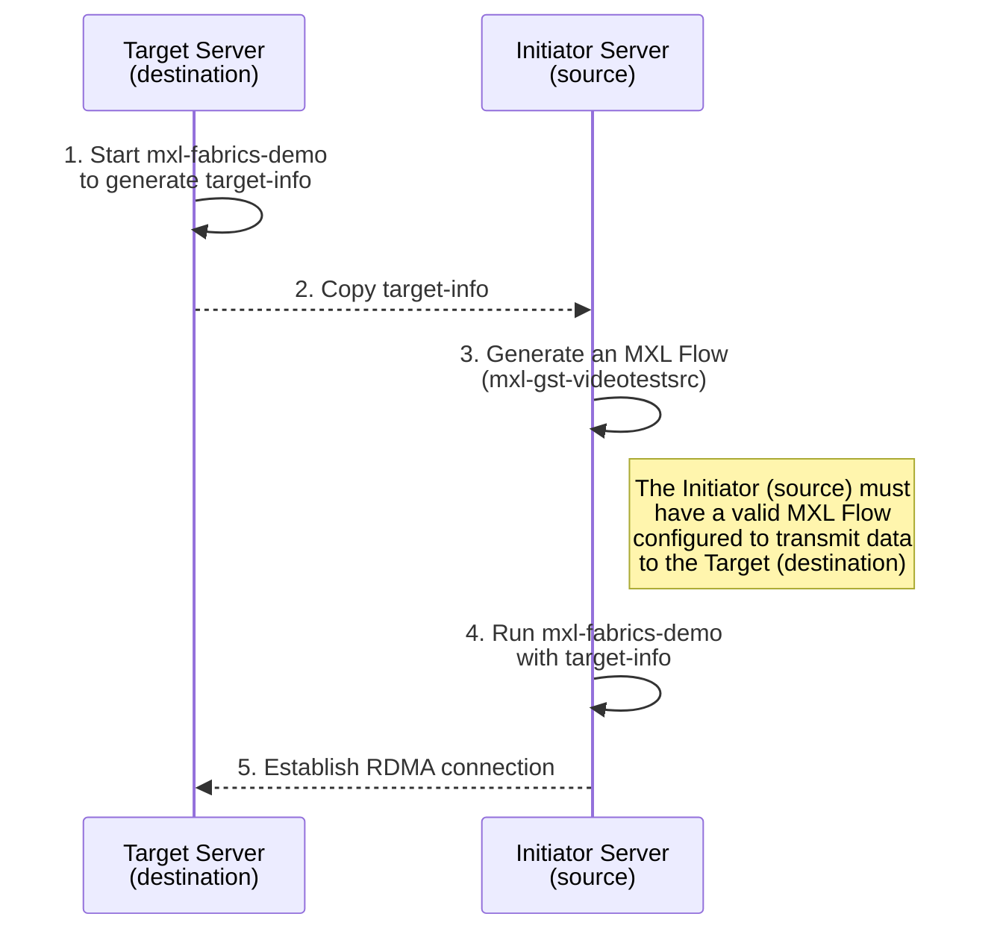

# MXL-Riedel RDMA Build and Testing Guide

This document provides a complete walkthrough for building and testing the **MXL-Riedel RDMA** environment on Ubuntu 22.04 and 24.04 systems.  
It covers installation prerequisites, build instructions, environment setup, test execution, and important notes for maintaining consistency between test servers.

## What is MXL and Why Use It?

**MXL (Media eXchange Layer)** is the foundational layer of the **Dynamic Media Facility (DMF)** reference architecture. It's an open-source initiative designed to enable seamless, interoperable media exchange between professional audio-visual production software.

**Key characteristics of MXL:**

- **Media Exchange Focus:** Specifically designed for efficient media data transfer between professional AV applications
- **Rapid Development:** Prioritizes software innovation and fast iteration cycles  
- **Collaborative Approach:** Joint effort between professional users and solution implementers
- **Global Initiative:** Open standard not restricted to any single company or geographic region

**The Challenge MXL Addresses:**

Traditional media workflows rely on rigid, hardware-dependent systems with dedicated network streams for media transport. This creates bottlenecks, increases costs, and limits flexibility in modern production environments.

Instead of using fixed hardware and dedicated network streams, MXL enables **containerized and distributed media functions** that can exchange media “grains” through **shared memory** or **high-speed fabrics** such as **RDMA (Remote Direct Memory Access)**.

- **Grains:** Units of media data (audio, video, or ancillary).  
- **Flows:** Continuous sequences of grains forming a media stream.

MXL provides:

- **APIs** for creating and managing media flows (e.g., reading/writing grains).  
- A **data model** describing the structure and handling of grains.  

By allowing processes to share or transfer grains directly through shared memory or RDMA, MXL significantly reduces latency and CPU overhead, avoiding the traditional packet-based transmission model

MXL supports two main modes for sharing grains:

1. **Shared Memory (Zero-Copy Ring Buffer)**  
   - Two processes on the **same host** share a common memory region.  
   - Both processes share a common memory region, allowing one to write and the other to read grains without copying — resulting in near-zero latency.  

2. **Libfabric Transport (Inter-Host Copying)**  
   - Used when grains need to be transferred between **different machines**.  
   - MXL leverages libfabric to efficiently copy grains between hosts using RDMA, EFA, or TCP.  
   - If RDMA is available, data transfer occurs directly between memory spaces on both hosts, minimizing CPU intervention.

## Table of Contents

1. [Before You Begin](#1-before-you-begin)  
2. [Prerequisite Libraries and Environment Checks](#2-prerequisite-libraries-and-environment-checks)  
3. [Cloning the MXL Repository](#3-cloning-the-mxl-repository)  
4. [Building MXL (Ubuntu 22.04 / 24.04)](#4-building-mxl-ubuntu-2204--2404)  
5. [Verifying the Build](#5-verifying-the-build)  
6. [Preparing the Test Environment](#6-preparing-the-test-environment)  
7. [Running the RDMA Tests](#7-running-the-rdma-tests)  
8. [Troubleshooting and Known Issues (Reserved)](#8-troubleshooting-and-known-issues-to-be-expanded)
9. [References](#9-references)

---

## 1. Before You Begin

This guide explains how to build and test the **MXL RDMA** environment directly on physical servers.  
It assumes an intermediate understanding of RDMA and Libfabric concepts.

### Required Equipment

- Two RDMA-capable servers running **Ubuntu 22.04** or **Ubuntu 24.04**.
- Each server must have an **InfiniBand** or **RoCE**-enabled NIC.
- Adequate disk space and available shared memory (`/dev/shm`).
- Stable network connection between both systems.

### Preliminary Steps

1. **Complete the MXL Hands-On Exercises:**  
   Before proceeding, complete the exercises in the official repo:  
   [MXL Hands-On Repository](https://github.com/cbcrc/mxl-hands-on/tree/main/Exercises)  
   These exercises provide foundational experience with Docker-based builds and RDMA functionality.

2. **Repository Location:**  
    Both servers must clone the repository into the **same home directory path**: `~/mxl-hands-on`

3. **Environment Consistency Tips:**

    - Use the same Ubuntu version on both servers.
    - Verify that both NICs have compatible RDMA driver and firmware versions.
    - Ensure Docker and Libfabric versions match on both machines.

---

## 2. Prerequisite Libraries and Environment Checks

Before building MXL, confirm that all dependencies are installed and the RDMA environment is functional.

### 2.1 Verify Installed Libraries and Interfaces

```bash
fi_info --version
whereis librdmacm.so
ip a
```

### 2.2 Install Required Packages (if missing)

```bash
sudo apt update
sudo apt install -y ninja-build docker.io git build-essential cmake
```

### 2.3 Verify Docker Installation

```bash
docker --version
docker run hello-world
```

## 3. Cloning the MXL Repository

### 3.1. Clone the CBC fork of the MXL project

```bash
git clone https://github.com/cbcrc/mxl-hands-on
cd ~/mxl-hands-on
```

### 3.2. Initialize the submodules

```bash
git submodule update --init
```

### 3.3. Confirm the repository structure

```bash
ls
# Expected directories:
# dmf-mxl/  tools/  scripts/
```

### 3.4. Switch the submodule to Riedel's [dmf-mxl/mxl](https://github.com/dmf-mxl/mxl) fork

Review [PR#78](https://github.com/dmf-mxl/mxl/pull/78) to identify the source `repository:branch` for the pull request. Add the parent repository as a new remote and check out the branch associated with the PR.

```bash
cd dmf-mxl
git remote -v # There should be 1 remote: origin
git remote add rdma https://github.com/jonasohland/mxl.git
git remote -v # There should be 2 remotes: origin and rdma
git fetch rdma
git checkout mxl-fabrics-squash
```

## 4. Building MXL (Ubuntu 22.04 / 24.04)

The MXL build process generates the necessary RDMA demo and source applications.
Both servers should follow the same procedure.

### 4.1 Build Configuration

Ensure that your build_all.sh file contains the following settings:

> **Note:** Docker must be run with increased shared memory (`--shm-size=2gb`) to ensure validation tests pass.
>
> To enable the Fabrics build, add `-DMXL_FABRICS_OFI=ON` to your CMake configuration.

```bash
BASE_IMAGE_VERSION=22.04    # or 24.04 depending on your system

MXL_PROJECT_PATH="./dmf-mxl"
-f ${MXL_PROJECT_PATH}/.devcontainer/Dockerfile.ubuntu-legacy # ensure the changes in devcontainer reflects the BASE_IMAGE_VERSION, choose accordingly 

ARCHITECTURES=("x86_64")
COMPILERS=("Linux-Clang-Release") # or "Linux-GCC-Release"

# Configure CMake
docker run --shm-size=2gb
# in CMake build options add -DMXL_FABRICS_OFI=ON

# Build Project
docker run --shm-size=2gb

# Run Tests
docker run --shm-size=2gb

```

> **Note**: Ubuntu 24.04 builds are generally smoother due to updated dependency compatibility.
>
> If building on 22.04, ensure Docker is correctly configured and dependencies are fully installed.*

### 4.2 Run the Build

From the repository root (~/mxl-hands-on):

```bash
./build_all.sh
```

Upon completion, confirm that no build errors are reported in the terminal output.

## 5. Verifying the Build

After the build completes successfully, verify the presence of the generated executables and configuration files.

### 5.1 Check Build Artifacts

```bash
ls ~/mxl-hands-on/dmf-mxl/build/Linux-Clang-Release_x86_64
```

Expected files include:

- `mxl-fabrics-demo`
- `mxl-gst-videotestsrc`
- Flow configuration files (e.g., `v210_flow.json`)

### 5.2 Confirm Executable Permissions

```bash
chmod +x <binary file> # makes a file executable, meaning the system is allowed to run it as a program

```

## 6. Preparing the Test Environment

### 6.1. Create the shared memory directory on both servers

```bash
sudo mkdir /dev/shm/mxl

df -h /dev/shm # Confirm sufficient shared memory space
```

### 6.2. Identify and note each server’s IP address

```bash
ip a

# The target server will use its own IP address in all test commands.
# The initiator server will reference the target’s IP.
```

### 6.3. Identify Flow configuration file

- The .json flow file defines the RDMA data path and configuration between initiator and target.
- The example v210_flow.json is provided in the build output directory.

## 7. Running the RDMA Tests

This section explains how to execute RDMA functional tests using the **verbs** provider.  
Optionally, you can use **TCP** as a control to verify the build and environment.

**Domain separation** is a core MXL feature that enables security, scalability, and workload isolation, as detailed in [Exercise 2 of cbcrc/mxl-hands-on](https://github.com/cbcrc/mxl-hands-on/blob/main/Exercises/Exercise2.md).  
Due to domain separation, memory sharing between domains is performed by copy, while within a domain, sharing is done by direct access.  
With this in mind, [PR#78](https://github.com/dmf-mxl/mxl/wiki/MXL-Inter-host-memory-sharing-%E2%80%90-Proposition#memory-models) implements RDMA by copy in its design.



**Legend:**

- **Target Server:** Runs `mxl-fabrics-demo`, generates `target-info`.
- **Initiator Server:** Starts `mxl-gst-videotestsrc`, runs `mxl-fabrics-demo` with `target-info`.
- **Arrows between servers** show transfer of `target-info` and RDMA connection establishment.

### Steps to test RDMA in MXL

1. **Start the `mxl-fabrics-demo` on the target host**  
   This will generate a `target-info` token required by the initiator.

2. **Copy the `target-info` to the initiator host**  
   This token is needed to establish the RDMA connection.

3. **Generate an MXL flow on the initiator host**  
   This source will define the flow to be shared.

4. **Start the `mxl-fabrics-demo` on the initiator**  
   Use the appropriate flow file and the `target-info` token to connect to the target.

Follow these steps to validate RDMA functionality and domain separation in your MXL environment.

### 7.1 Target Server

Run the following command to start the demo target:

```bash
./mxl-fabrics-demo -d /dev/shm/mxl -f v210_flow.json -n <server_ip> --service 5000 -p verbs
```

>- The target invokes fi_fabric() and fi_domain() to create a libfabric fabric using the specified provider (e.g., verbs for RDMA).
>- It **allocates a ring buffer** — a region of shared memory — where incoming grains will be written.
>- A Target Flow object is created, containing the necessary connection information for the initiator (including the fabric address and memory registration key, or RKey)

### 7.2 Initiator Server

#### Start an MXL source

```bash
./mxl-gst-videotestsrc -d /dev/shm/mxl/domain -f v210_flow.json
```

> This generates video grains (in V210 format) that will be transferred

Open a new session (tab) on the Initiator Server and run:

#### Send MXL flow to target

```bash
./mxl-fabrics-demo -d /dev/shm/mxl -f <flow_uuid> -i -n <server_ip> --service 5000 -p verbs --target-info <copied_from_target>
```

>- Once the target info is obtained, the initiator parses it to extract the target’s fabric address and RKey
>- Using this information, it performs a Remote Write — a type of RDMA operation that allows direct modification of the target’s memory without involving the remote CPU.
>- The initiator’s NIC uses Direct Memory Access (DMA) to write the media grains straight into the target’s ring buffer — achieving low-latency, high-throughput data transfer

### Example Successful Output

**Target Server:**

<div style="border:1px solid #333; padding:10px; border-radius:4px; background:#f7f7f7;">

<pre>
[2025-10-29 18:39:09.640] [info] [Endpoint.cpp:109] Endpoint 17637498168822997553 created
[2025-10-29 18:39:09.689] [info] [RCTarget.cpp:147] Received connected event notification, now connected.
[2025-10-29 18:39:09.691] [info] [demo.cpp:503] Committed grain with index=33018 commitedSize=5529600 grainSize=5529600
[2025-10-29 18:39:09.757] [info] [demo.cpp:503] Committed grain with index=33019 commitedSize=5529600 grainSize=5529600
[2025-10-29 18:39:09.824] [info] [demo.cpp:503] Committed grain with index=33020 commitedSize=5529600 grainSize=5529600
[2025-10-29 18:39:09.858] [info] [demo.cpp:503] Committed grain with index=33021 commitedSize=5529600 grainSize=5529600
[2025-10-29 18:39:09.891] [info] [demo.cpp:503] Committed grain with index=33022 commitedSize=5529600 grainSize=5529600
[2025-10-29 18:39:09.924] [info] [demo.cpp:503] Committed grain with index=33023 commitedSize=5529600 grainSize=5529600
[2025-10-29 18:39:09.958] [info] [demo.cpp:503] Committed grain with index=33025 commitedSize=5529600 grainSize=5529600
[2025-10-29 18:39:10.024] [info] [demo.cpp:503] Committed grain with index=33026 commitedSize=5529600 grainSize=5529600
[2025-10-29 18:39:10.058] [info] [demo.cpp:503] Committed grain with index=33027 commitedSize=5529600 grainSize=5529600
[2025-10-29 18:39:10.058] [info] [demo.cpp:503] Committed grain with index=33028 commitedSize=5529600 grainSize=5529600
[2025-10-29 18:39:10.058] [info] [demo.cpp:503] Committed grain with index=33029 commitedSize=5529600 grainSize=5529600
</pre>

</div>


>- On the target side, the "Comitted Grain" message shows each incoming frame being fully recived into the ring buffer
>- Each index, corresponds to one slot in the target's shared ring buffer

**Initiator Server:**  
<div style="border:1px solid #333; padding:10px; border-radius:4px; background:#f7f7f7;">

<pre>

2025-10-29 18:39:11.495 [info] [Endpoint.cpp:109] Endpoint 4403181769275151222 created
2025-10-29 18:39:11.495 [info] [RCInitializer.cpp:95] Endpoint has been idle for 534406861ms, activating
2025-10-29 18:39:11.746 [info] [RCInitiator.cpp:130] Endpoint is now connected

</pre>

</div>

---

## 8. Troubleshooting and Known Issues (To be Expanded)

*This section will be expanded with specific issues and fixes based on ongoing testing (Libfabric issues, Driver, Network Config, Docker. many many more :| ).*

---

## 9. References

- [EBU DMF/MXL Official page](https://tech.ebu.ch/dmf/mxl)
- [CBC MXL Forked Repository](https://github.com/cbcrc/mxl-hands-on)
- [Reidel MXL Repository (#PR78)](https://github.com/dmf-mxl/mxl/pull/78)
- [MXL Exercises](https://github.com/cbcrc/mxl-hands-on/tree/main/Exercises)
- [Team Confluence Page](https://cbcradiocanada.atlassian.net/wiki/spaces/ENG/pages/5597298950/RDMA+Network) – Detailed explanations of test behavior and provider-level analysis
- Reach out to Alexandre Dugas and Sunday Nyamweno for more detail
